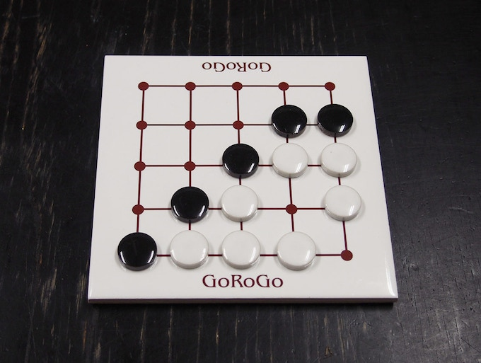

# Little-Go Game AI Agent

This Go game AI agent is implemented in Python using the Minimax algorithm to play the game of Go. The agent considers various game states and employs strategic decision-making.
This is a homework assigment for CSCI561 Foundation of Artificial Intelligence

<p align="center"></p>

## Usage

### Install Dependencies

Ensure you have Python installed. No additional installations are required, as the algorithm uses standard libraries.

### Input File

Provide the input coordinates in the `input.txt` file. The format should be:

```plaintext
<player>
<prev_state>
<curr_state>
```

## Run the Algorithm

Execute the following command to run the AI agent:

```bash
python little_go.py
```

# Output

The algorithm generates an `output.txt` file containing the next move for the player.

## Game Overview

### Player Representation:

- Black Piece: 1
- White Piece: 2

### Board Representation:

- The board is a 5x5 grid.

### Move Representation:

- Coordinates for moves are represented as (x, y) on the grid.

## Algorithm Details

The AI agent uses the Minimax algorithm with alpha-beta pruning to search for the best move. It considers factors such as player pieces count, liberty count, and edge counts for evaluation.

## File Structure

### Input Files:

- `input.txt`: Contains input coordinates and game states.

### Output Files:

- `output.txt`: Contains the AI agent's next move.

### Auxiliary Files:

- `step_num.txt`: Keeps track of the steps.

## Adjusting Parameters

Explore and modify algorithm parameters for different game instances. Adjust the search depth and branching factor (`search_max_depth` and `b_factor` in the code) based on preferences.

## Note

This AI agent is designed for educational purposes and can be enhanced for more sophisticated gameplay.

## References
- [CSCI 561- Fall 2023-Homework 2.pdf](https://github.com/darshanrao/Little-Go-Game/blob/main/2023F_HW2-Description.docx.pdf)

Happy coding and enjoy playing Go with the AI agent!
